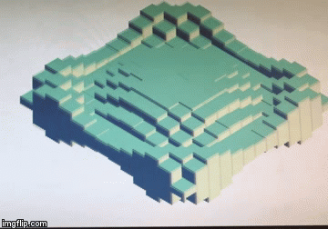

# **CubeWave**

It was created as part of the course, ECE243 - Computer Organization, in University of Toronto. The graphic was implemented pixel by pixel, without any graphic library invovled. Course topics such as double buffering and interrupt were used.

## Getting Started
To run this code you need **DE1-SoC** board, with ARMv7 configuration.
